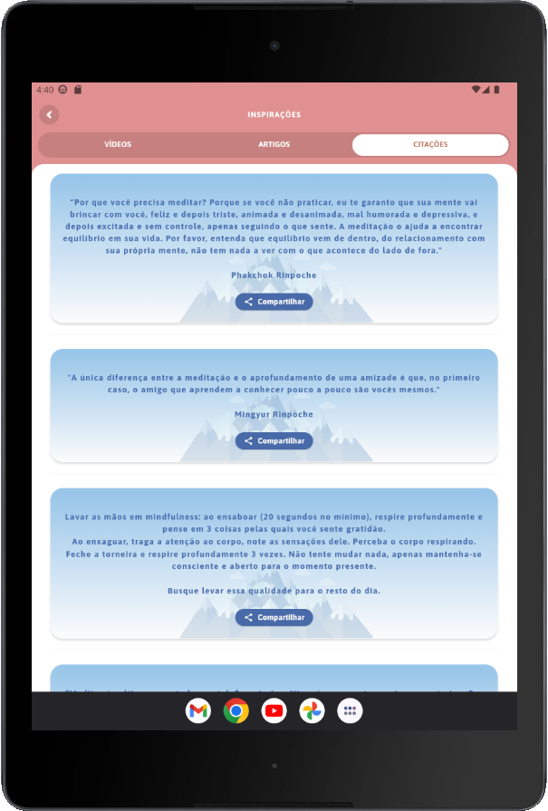

# lojongapp
Poc de apresentação das features novas do cliente lojong

## Requirements
```
brew tap leoafarias/fvm
brew install fvm
dart pub global activate fvm
```

## Running
```
fvm use stable
fvm flutter clean
fvm flutter pub get
fvm flutter run
```

## Screenshots

### Nexus One


### Nexus 4


### Nexus 6


### Nexus 9

